# Fast Multi(Interpolative) Style Transfer
Implementation of Google Brain's [A Learned Representation For Artistic Style](https://arxiv.org/pdf/1610.07629v2.pdf) in Tensorflow.
You can mix various type of style images using just One Model and it's still Fast!

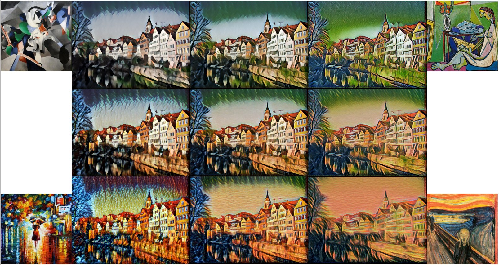

Figure1. Using one model and making multi style transfer image. Center image is mixed with 4 style

This paper is next version of [Perceptual Losses for Real-Time Style Transfer and Super-Resolution](https://arxiv.org/abs/1603.08155)
and [Instance Normalization: The Missing Ingredient for Fast Stylization](https://arxiv.org/abs/1607.08022).
These papers are fast and nice result, but one model make only one style image.

## Usage
Recommand to download project files (model, vgg, image, etc.) [One drive](https://1drv.ms/f/s!ArFpOdlDcjqQga8fwL0m4VQGmgKSfg) / [Dropbox](https://www.dropbox.com/sh/b3by1ipmr0v821y/AABJ4gadaOk9RRsqsOTC336Xa?dl=0). And Download [COCO](http://mscoco.org/dataset/#download) on your data folder. Example command lines are below and train_style.sh, test_style.sh.

#### Project folder tree
    Working Directory
    ├── MST
    │   ├── models
    │   │   ├── checkpoint
    │   │   ├── xxx.index
    │   │   ├── xxx.data
    |   │   └── xxxx.meta
    │   ├── test_result
    │   └── train_result
    ├── images
    │   ├── style
    │   ├── style_crop
    │   ├── test
    │   └── crop.py
    ├── src
    │   ├── vgg19.mat
    │   └── ...
    ├── main.py
    ├── test_style.sh
    └── train_style.sh
    
    

#### Style Control Weight (SCW)
"-scw, --style_control_weights" is style control argument. "0 0 0 ... 0 0 0 " means weight of "style1 style2 ... style16"

If you want single style

    style1   -scw "1 0 0 ... 0 0 0"
    style16  -scw "0 0 0 ... 0 0 1" 

If you want multi style

    0.5 * style1 + 0.5 * style2                   -scw "0.5 0.5 0 ... 0 0 0"      or "1 1 0 ... 0 0 0"
    0.2 * style1 + 0.3 * style2 + 0.4 * style3    -scw "0.2 0.3 0.4 ... 0 0 0"    or "2 3 4 ... 0 0 0"
    1/16 * (style1 ~ style16)                     -scw "0.63 0.63 ... 0.63 0.63"  or "1 1 1 ... 1 1 1"

### Train
#### From Scratch.

    python main.py -f 1 -gn 0 -p MST -n 10 -b 16 \
      -tsd images/test -sti images/style_crop/0_udnie.jpg \
      -ctd /mnt/cloud/Data/COCO/train2014 \
      -scw 1 0 0 0 0 0 0 0 0 0 0 0 0 0 0 0 \

Train weight, bias, gamma_0, beta_0. Need 40000 iteration (10 epoch)

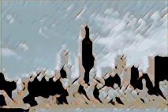

#### Fine-Tuned. (after train 'from scratch' or download trained model)

    python main.py -f 1 -gn 0 -p MST -n 1 -b 16 \
      -tsd images/test -sti images/style_crop/1_la_muse.jpg \
      -ctd /mnt/cloud/Data/COCO/train2014 \
      -scw 0 1 0 0 0 0 0 0 0 0 0 0 0 0 0 0 \

Train only gamma_i, beta_i. Just need 4000 iteration (1 epoch, 1/10 scratch)

You can see that images gradually change to new style. 

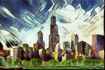

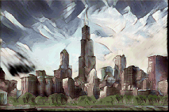

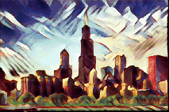

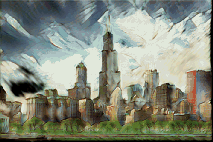
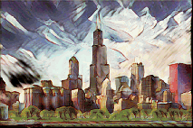

#### Number of style
if you want to train 32-style model, edit main.py and -scw range (16 to 32)

    1. parser.add_argument("-scw", "--style_control_weights", type=float, nargs=16 --> 32)
    2. -scw 1 2 3 ... 14 15 16  -->  -scw 1 2 3 ... 30 31 32

### Test
#### Single style

    ex) style9
    python main.py -f 0 -gn 0 -p MST \
      -tsd images/test \
      -scw 0 0 0 0 0 0 0 0 1 0 0 0 0 0 0 0 

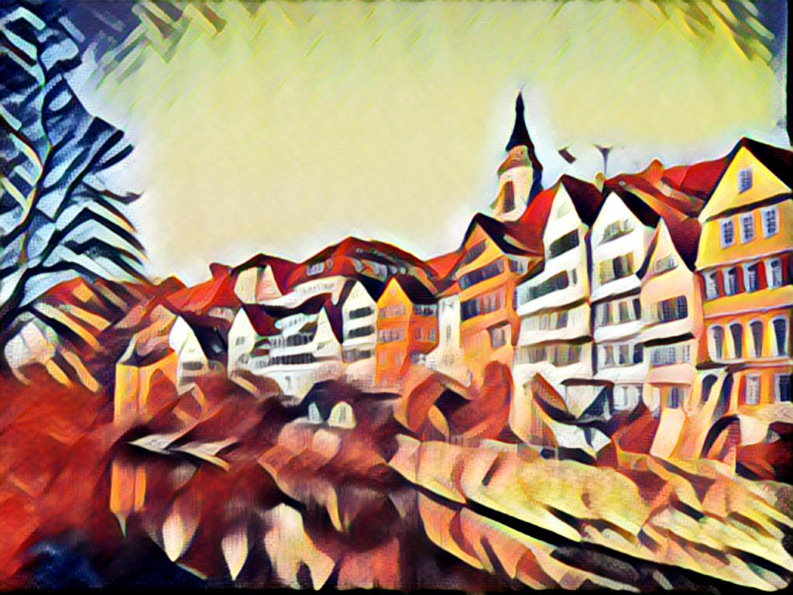

    ex) style10
    python main.py -f 0 -gn 0 -p MST \
      -tsd images/test \
      -scw 0 0 0 0 0 0 0 0 0 1 0 0 0 0 0 0

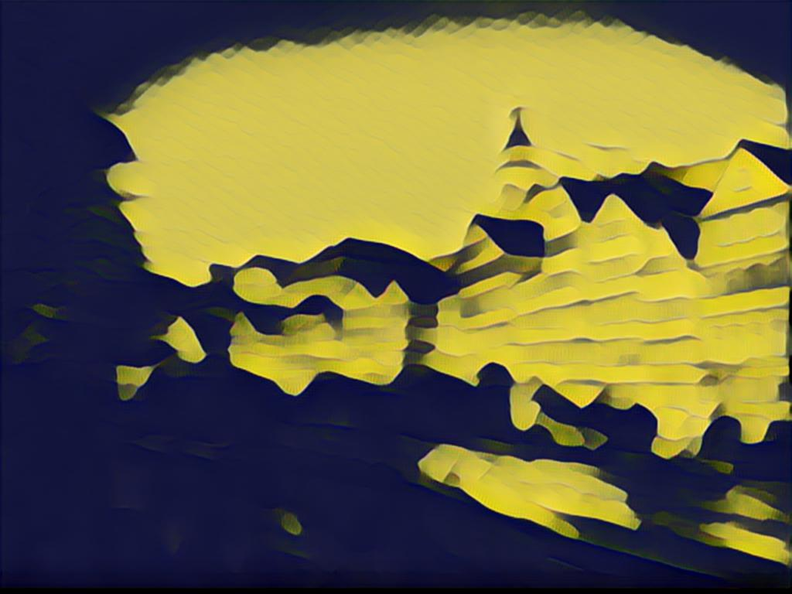

#### Multi Style

    ex) 0.5*style9 + 0.5*style10
    python main.py -f 0 -gn 0 -p MST \
      -tsd images/test \
      -scw 0 0 0 0 0 0 0 0 0 0.5 0.5 0 0 0 0 0  \

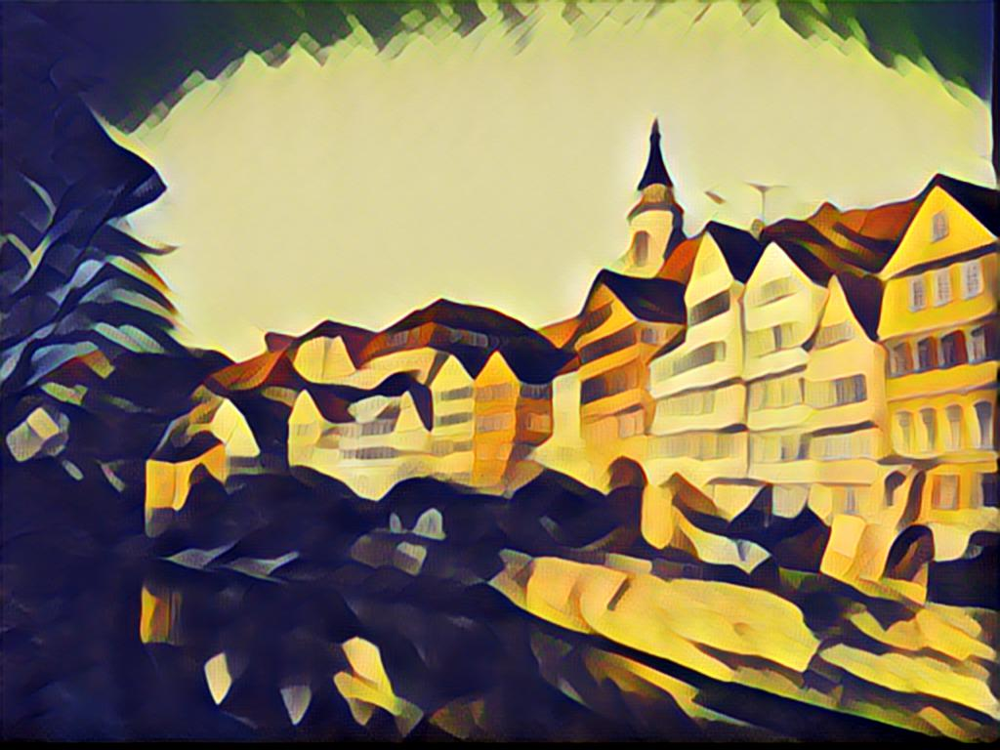

    ex) 0.33*style9 + 0.33*style10 + 0.33*style11
    python main.py -f 0 -gn 0 -p MST \
      -tsd images/test \
      -scw 0 0 0 0 0 0 0 0 0 0.33 0.33 0.33 0 0 0 0  \

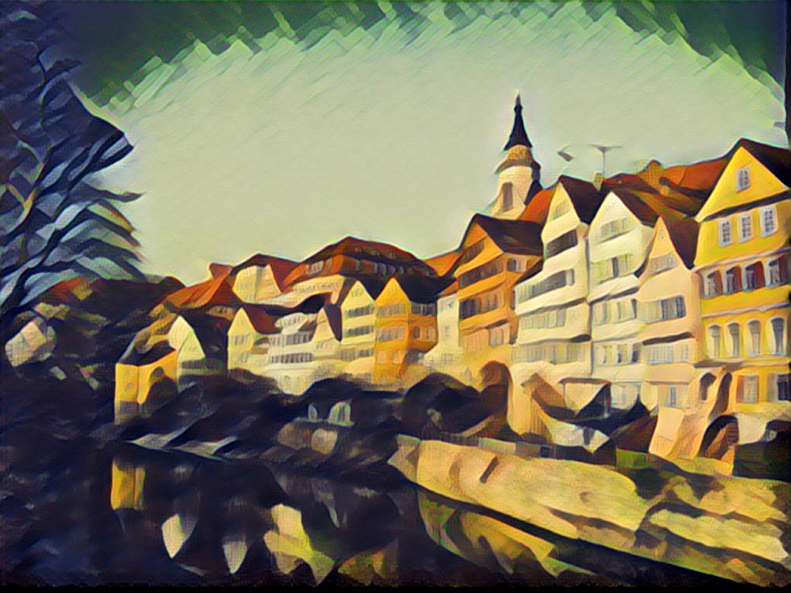

## Implementation Details
#### Conditional instance normalization

The key of this paper is Conditional instance normalization.

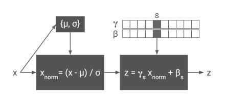

Instance normalization is similar with batch normalization, but it doesn't accumulate mean(mu), variance(alpha). 
Conditional instance normalization have N scale(gamma) and N shift(beta). N is number of style images.
This means when you add new style, you just train new gamma and new beta.
See the below code.

    def conditional_instance_norm:
        ...
        shift = []
        scale = []

        for i in range(len(style_control)):
            with tf.variable_scope('{0}'.format(i) + '_style'):
                shift.append(tf.get_variable('shift', shape=var_shape, initializer=tf.constant_initializer(0.)))
                scale.append(tf.get_variable('scale', shape=var_shape, initializer=tf.constant_initializer(1.)))
        ...
        
        idx = [i for i, x in enumerate(style_control) if not x == 0]
        style_scale = reduce(tf.add, [scale[i]*style_control[i] for i in idx]) / sum(style_control)
        style_shift = reduce(tf.add, [shift[i]*style_control[i] for i in idx]) / sum(style_control)
        output = style_scale * normalized + style_shift

#### Upsampling
Paper's upsampling method is "Image_resize-Conv". But I use ["Deconv-Pooling"](https://arxiv.org/abs/1611.04994)
    
    def mst_net:
        ...
        x = conv_tranpose_layer(x, 64, 3, 2, style_control=style_control, name='up_conv1')
        x = pooling(x)
        x = conv_tranpose_layer(x, 32, 3, 2, style_control=style_control, name='up_conv2')
        x = pooling(x)
        ...
        

## Requirements
- TensorFlow 1.0.0
- Python 2.7.12, Pillow 3.4.2, scipy 0.18.1, numpy 1.11.2

## Attributions/Thanks
This project borrowed some code from [Lengstrom's fast-style-transfer.](https://github.com/lengstrom/fast-style-transfer)
And Google brain's code is [here](https://github.com/tensorflow/magenta) (need some install)
